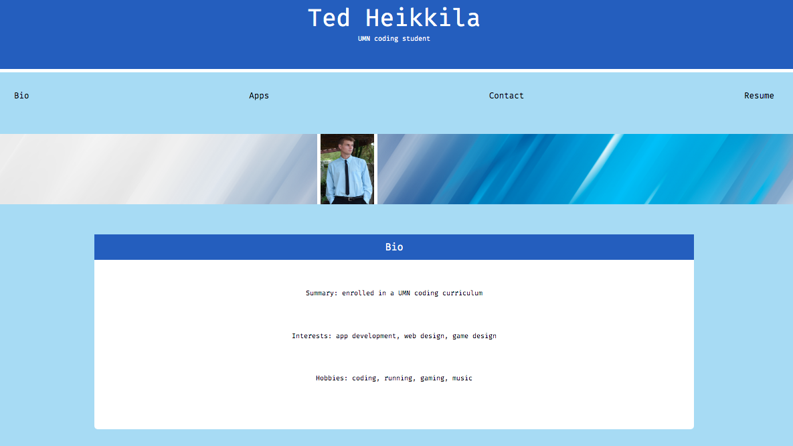
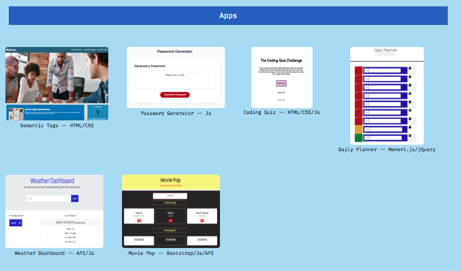

# professional-portfolio

Summary: 
 
The objective of this application is to function as a portfolio containing professional content and working applications. HMTL, CSS, and Git were used. Please check back during the summer months of 2021, as content will be updated periodically. All past homework and project 1 have been updated as of 6/29/21. For best results, please render using Chrome.

Breakdown: 
 
Navigation links have been set up to scroll to the associated content. An "About Me" section highlights bio, interests, and hobbies. The current portfolio contains homework assignments 1-6 and group project 1. These applications will be updated periodically throughout the curriculum and finalized at the end of the course to reflect all bootcamp applications. "Contact Me" contains a fake number and email, but the GitHub and LinkedIn links are legitimate. Finally, a footer link has been added so the user can more conveniently return to the top of page.

URL:
 
Check out the deployed application here: https://tedheikkila.github.io/professional-portfolio/

Application screenshots:
 
 
 
 

 